## OOP LAB: Pac-Man Game in Java

This project is a simple Pac-Man game implemented in Java as part of the OOP Lab coursework.

---

## 📁 Folder Structure

- `src/` – Contains all source files.
- `src/images/` – Contains all game image assets.
- `lib/` – Contains all external dependencies or libraries.

---

## 🎮 Game Features

1. **Bonus Food** – Extra points available by eating bonus items.
2. **Ghost Scared Mode** – Press `Space` to activate scared mode for ghosts.
3. **Pause Game** – Press `P` to pause the game.
4. **Two Differnet Levels** – The game includes two levels of increasing difficulty.
5. **Pac-Man Controls** – Use **arrow keys** to move Pac-Man.

---

## 🧩 Project Class Diagram

```mermaid
classDiagram
    %% Main Classes
    class App {
        +main(String[] args)$ void
    }
    
    class GameFrame {
        -tileSize: int
        -rows: int
        -cols: int
        +GameFrame()
        +start() void
    }
    
    class GamePanel {
        -board: GameBoard
        -timer: Timer
        -isPaused: boolean
        +GamePanel(int, int, int)
        +paintComponent(Graphics) void
        +actionPerformed(ActionEvent) void
        +keyPressed(KeyEvent) void
        -gamePause() void
    }
    
    class GameBoard {
        -rows: int
        -cols: int
        -tileSize: int
        -walls: Set~GameEntity~
        -foods: Set~GameEntity~
        -ghosts: Set~Ghost~
        -pacman: PacMan
        -score: int
        -lives: int
        -gameOver: boolean
        -scareMode: boolean
        -levelComplete: boolean
        -scaredTimer: int
        -bonusFood: GameEntity
        -bonusTimer: int
        -currentLevel: int
        -ghostSpeedMultiplier: float
        -layout1: String[]
        -layout2: String[]
        -currentLayout: String[]
        +GameBoard(int, int, int)
        +loadMap() void
        -loadNextLevel() void
        +draw(Graphics) void
        +update() void
        -createBonusFood() void
        +activateScareMode() void
        +handleKeyPress(KeyEvent) void
        +resetPositions() void
        +isGameOver() boolean
    }
    
    class GameEntity {
        #x: int
        #y: int
        #size: int
        #oldX: int
        #oldY: int
        #image: Image
        +GameEntity(int, int, int)
        +setImage(String) void
        +draw(Graphics) void
        +collidesWith(GameEntity) boolean
    }
    
    class PacMan {
        -dx: int
        -dy: int
        -pacmanImages: Image[]
        -imagesLoaded: boolean
        +PacMan(int, int, int)
        +setDirection(char) void
        +move() void
        +undo() void
        +setPosition(int, int) void
        +reset() void
        +draw(Graphics) void
        -drawWithImages(Graphics) void
        -loadImages() void
        -scaleImage(Image) Image
    }
    
    class Ghost {
        -dx: int
        -dy: int
        -rand: Random
        -normalImage: Image
        -scaredImage: Image
        -isScared: boolean
        -ghostColor: GhostColor
        -imagesLoaded: boolean
        -scaredTimer: int
        -speed: float
        +Ghost(int, int, int, GhostColor)
        +setScared(boolean) void
        +update() void
        +isScared() boolean
        +setRandomDirection() void
        +setSpeed(float) void
        +move(Set~GameEntity~) void
        +reset() void
        +geColor() GhostColor
        -loadImages() void
        -scaleImage(Image) Image
        +draw(Graphics) void
    }
    
    %% Enum
    class GhostColor {
        <<enumeration>>
        RED
        PINK
        SCARED
    }
    
    %% Relationships
    App --> GameFrame : creates
    
    GameFrame "1" *-- "1" GamePanel : contains
    
    GamePanel "1" *-- "1" GameBoard : contains
    GamePanel --|> KeyListener : implements
    GamePanel --|> ActionListener : implements
    
    GameBoard "1" *-- "1" PacMan : contains
    GameBoard "1" *-- "0..*" Ghost : contains
    GameBoard "1" *-- "0..*" GameEntity : contains (walls/foods)
    
    PacMan --|> GameEntity : extends
    Ghost --|> GameEntity : extends
    
    Ghost "1" *-- "1" GhostColor : has
```

## 🖼️ Game Preview

